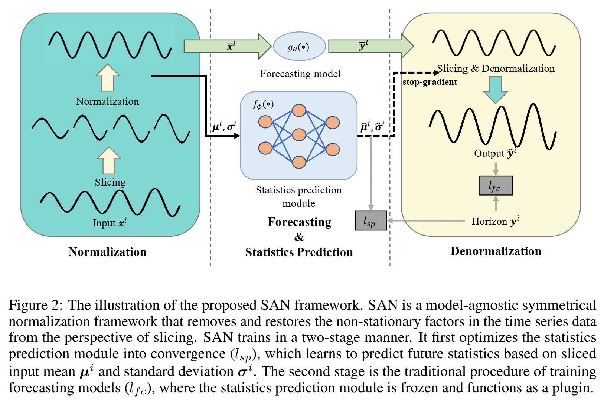
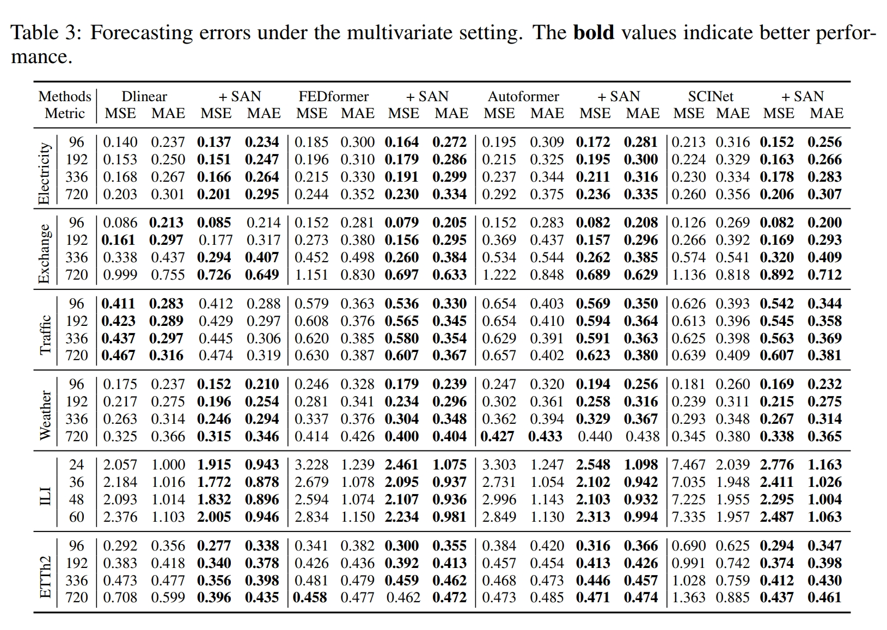
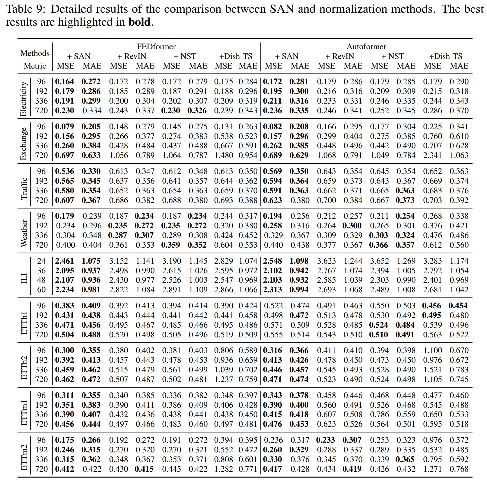

## SAN (NeurIPS 2023)

---

This repo is the official Pytorch implementation of our NeurIPS 2023 paper: Adaptive Normalization for Non-stationary Time Series Forecasting: A Temporal Slice Perspective.

### Introduction

Time series data suffer from a non-stationary issue where the statistical properties or the distributions of the data vary rapidly over time. We further argue that the distribution is inconsistent across compact time slices and such inconsistency is not just on a per-instance basis. To alleviate the impact of such property, we propose a model-agnostic normalization framework named SAN. SAN models the non-stationarity in the fine-grained  temporal slices and explicitly learn to estimate future distributions, simplifying the the non-stationary forecasting task through divide and conquer.



We conduct comparison experiments on **9 widely used datasets** with mainstream forecasting backbones, we also compare the performance of SAN and other plug-and-play non-stationary methods.

Multivariate forecasting results:



Comparison with other plug-and-play non-stationary methods:



### Usage

#### Environment and dataset setup

```bash
pip install -r requirements.txt
mkdir datasets
```

All the 9 datasets are available at the [Google Driver](https://drive.google.com/drive/folders/1ZOYpTUa82_jCcxIdTmyr0LXQfvaM9vIy) provided by Autoformer. Many thanks to their efforts and devotion!

#### Running

We provide ready-to-use scripts for SAN enhanced backbone models.

```bash
sh run_linear.sh # scripts for DLinear
sh run_trms.sh # scripts for Transformers (Autoformer/FEDformer/Informer/Transformer)
```

#### Tuning

For other forecasting task and backbones, we can tune the **only two** parameters of SAN, `period_len` and `station_lr`, which presents $T$ in our paper and the learning rate of the statistics prediction module respectively. 

### Acknowledgement

This repo is built on the pioneer works. We appreciate the following GitHub repos a lot for their valuable code base or datasets:

[Informer](https://github.com/zhouhaoyi/Informer2020)

[Autoformer](https://github.com/thuml/Autoformer)

[DLinear](https://github.com/cure-lab/LTSF-Linear)

### Citation

If you find this repository useful for your work, please consider citing it as follows:

```bibtex
@inproceedings{liu2023adaptive,
  title={Adaptive Normalization for Non-stationary Time Series Forecasting: A Temporal Slice Perspective},
  author={Liu, Zhiding and Cheng, Mingyue and Li, Zhi and Huang, Zhenya and Liu, Qi and Xie, Yanhu and Chen, Enhong},
  booktitle={Thirty-seventh Conference on Neural Information Processing Systems},
  year={2023}
}
```

